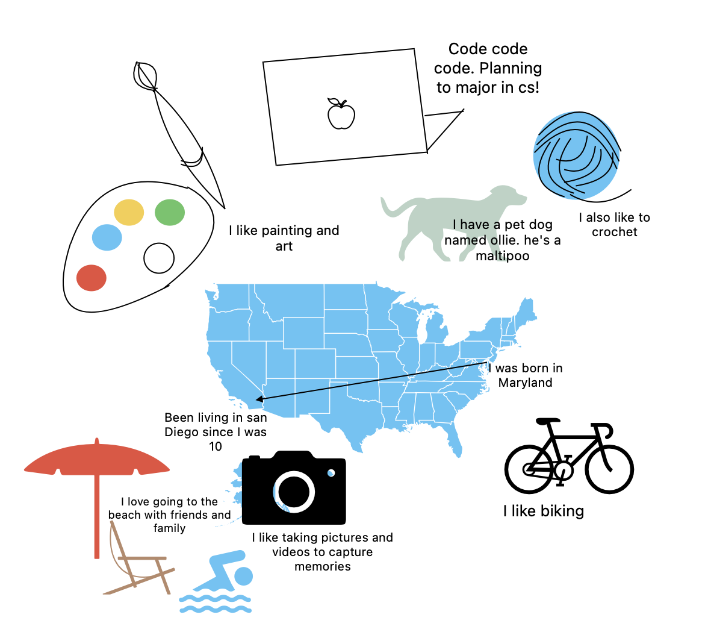

<!-- <html>
<body>
<header>

  

    <nav>
      <ul>
        <li class="fork"><a href="{{site.baseurl}}/">Home</a></li>
        <li class="fork"><a href="{{site.baseurl}}/csa">CSA</a></li>
        <li class="fork"><a href="{{site.baseurl}}/blogs">Blogs</a></li>
        <li class="title"><a href="{{ site.github.repository_url }}#readme">View On GitHub</a></li>
      </ul>
    </nav>
  

</header>
</body>
</html>

 -->

## Vivian's CSA Blog 
Hi, my name is Vivian! I'm a rising senior for the class of 2024! Excited to do another year of code code code. Here's a little bit about me:

    

# Here's my Tri 1 Schedule

[Click this](https://delnorte.powayusd.com/apps/bell_schedules/) for Del Norte's Schedule

| Class | Period | Homework |
|---|---|---|
| AP Stats | 1 | Check your understanding |
| AP Gov | 2 | Liberal and Conservative Notes |
| AP CSA | 3 | Setup local GitHub Pages and customize blogs |
| Honors MI | 4 | Share personal Locker |
| Off Roll | 5 | go home |
